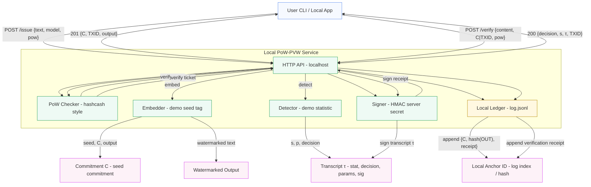

# PoW‑PVW — Proof‑of‑Work Metered, Publicly Verifiable Watermarking (Local Demo)

Minimal local implementation showing:
- **/issue** (v2 internals): derives a seed from the PoW ticket via HKDF, embeds a deterministic watermark, logs a commitment and ticket_hash
- **/verify_v2**: verify with a PoW ticket by recomputing seed; or verify with legacy evidence (commitment/txid)
- **/verify**: legacy verification (pattern presence), kept for compatibility

> ⚠️ This is a **toy reference**: the watermark embed/detect is a simple seed‑tag demo so you can validate the protocol. Swap in real detectors (e.g., `jwkirchenbauer/lm-watermarking`, `REMARK-LLM`) behind the same interface.

## What changed (Variant A)

- Seed is now derived deterministically from the PoW ticket using HKDF‑SHA256 with a server salt.
- Embedder/detector are seed‑aware and deterministic.
- Ledger issue records include `ticket_hash` and `commitment` (no raw seed stored).
- New endpoint `/verify_v2` accepts a `ticket` (preferred) or `evidence`.
- Secrets separated: `SERVER_SALT` (for HKDF/commitments) and `SERVER_KEY` (for HMAC receipts).

## Quickstart

```bash
python -m venv .venv && source .venv/bin/activate
pip install -r requirements.txt
uvicorn app.main:app --reload
```

### Configure secrets (optional)

By default the app will auto‑create files in `data/`:
- `data/server_salt.bin` — server salt for HKDF and commitments
- `data/hmac.key` — HMAC key for receipts/transcripts

You can override them with environment variables (hex/base64/raw supported):

```powershell
# PowerShell examples
$env:SERVER_SALT = "$( [BitConverter]::ToString((1..32|%{0x11})) -replace '-', '').ToLower()" # 32 bytes of 0x11 (demo)
$env:SERVER_KEY  = "$( [BitConverter]::ToString((1..32|%{0x22})) -replace '-', '').ToLower()" # 32 bytes of 0x22 (demo)
```

### MermaID architecture



## PoW ticket

Server checks: `SHA256(client_id | endpoint | body_hash | nonce)` has **leadingZeros >= difficulty**.

For this demo, we bind PoW to the content being embedded or verified. In v2 flows we derive the seed from the canonical ticket JSON.

Fields:

```json
{
  "client_id": "string",
  "endpoint": "/issue" | "/verify",
  "body_hash": "hex(sha256(content))",
  "nonce": "hex|int",
  "difficulty": 8 | 12 | 20 | ...
}
```

Compute `body_hash` as hex SHA256 of the content string.

## API examples (PowerShell)

Below are simple PowerShell examples suitable for Windows. Difficulty is set low for demo purposes.

### 1) Issue (embed)

```powershell
$text = "hello world"
$client = "you"
$bh = (
  $bytes = [Text.Encoding]::UTF8.GetBytes($text);
  ([Security.Cryptography.SHA256]::Create()).ComputeHash($bytes) |
    ForEach-Object { $_.ToString('x2') }
) -join ''

function Get-LeadingZeroBits($hex) {
  $bin = [Convert]::ToString([bigint]::Parse('00' + $hex, [System.Globalization.NumberStyles]::HexNumber), 2).PadLeft(256,'0')
  return ($bin.Length - ($bin.TrimStart('0').Length))
}

$nonce = 0; $diff = 12
while ((Get-LeadingZeroBits ((
  $material = [Text.Encoding]::UTF8.GetBytes("$client|/issue|$bh|$nonce");
  ([Security.Cryptography.SHA256]::Create()).ComputeHash($material) |
    ForEach-Object { $_.ToString('x2') }
) -join '')) -lt $diff) { $nonce++ }

$body = @{ text=$text; model_id='demo'; client_id=$client; pow=@{ body_hash=$bh; nonce="$nonce"; difficulty=$diff } } | ConvertTo-Json -Depth 5
curl -s http://localhost:8000/issue -H 'Content-Type: application/json' -d $body
```

### 2) Verify (seed‑aware)

Use the issuance ticket to verify the returned watermarked text via `/verify_v2`:

```powershell
$ticket = @{ client_id=$client; endpoint='/issue'; body_hash=$bh; nonce="$nonce"; difficulty=$diff }
$verifyBody = @{ content = '<paste watermarked here>'; client_id=$client; ticket=$ticket } | ConvertTo-Json -Depth 5
curl -s http://localhost:8000/verify_v2 -H 'Content-Type: application/json' -d $verifyBody
```

### 3) Verify (legacy evidence)

If you only kept the commitment/txid from issuance, you can still verify with the legacy detector:

```powershell
$verifyLegacy = @{ content = '<watermarked>'; client_id=$client; evidence=@{ commitment = '<C>' };
  pow = @{ body_hash = '<sha256(content)>'; nonce='0'; difficulty = 12 } } | ConvertTo-Json -Depth 6
curl -s http://localhost:8000/verify -H 'Content-Type: application/json' -d $verifyLegacy
```

## Swap in real watermarking

Replace `app/watermark/embed.py` and `app/watermark/detect.py` with wrappers around real repos (LM‑watermarking, REMARK‑LLM, or Publicly Detectable Watermarking). Keep the function signatures.

## Records & receipts

Issue records (JSONL):

```json
{
  "type":"issue",
  "ts": 1730332800000,
  "client_id":"you",
  "model_id":"demo",
  "commitment":"<hex>",
  "ticket_hash":"<hex>",
  "output_hash":"<hex>",
  "policy_v":1,
  "receipt_sig":"<hmac>"
}
```

Verify v2 transcript:

```json
{
  "type":"verify",
  "ts": 1730332805000,
  "client_id":"you",
  "commitment":"<hex>",
  "content_hash":"<hex>",
  "statistic":1.0,
  "pvalue":0.01,
  "decision":true,
  "ticket_hash":"<hex>",
  "policy_v":1
}
```

> Note: HMAC receipts use `SERVER_KEY`. For public verification, replace HMAC with Ed25519.

---

**References**: Puppy (public verifiability), ZK detection, LM‑watermarking, SynthID‑Text, blockchain anchoring (see proposal).
