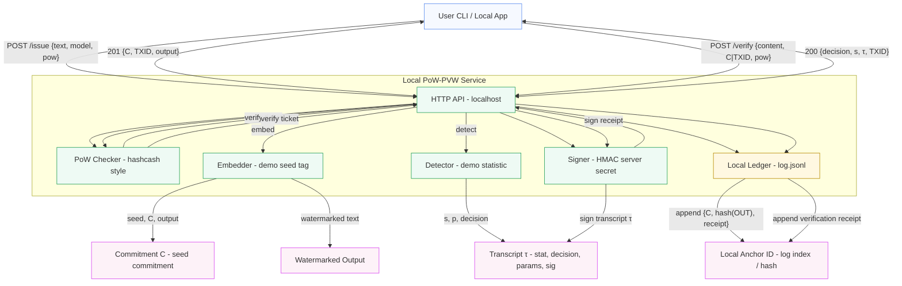

# PoW‑PVW — Proof‑of‑Work Metered, Publicly Verifiable Watermarking (Local Demo)

Minimal local implementation showing:
- **/issue**: embed a watermark and log a commitment with a PoW ticket
- **/verify**: verify watermark with a PoW ticket and write a signed receipt

> ⚠️ This is a **toy reference**: the watermark embed/detect is a simple seed‑tag demo so you can validate the protocol. Swap in real detectors (e.g., `jwkirchenbauer/lm-watermarking`, `REMARK-LLM`) behind the same interface.

## Quickstart

```bash
python -m venv .venv && source .venv/bin/activate
pip install -r requirements.txt
uvicorn app.main:app --reload
```

### MermaID architecture



## PoW ticket

Server checks: `SHA256(client_id | endpoint | body_hash | nonce)` has **leadingZeros >= difficulty**.

Compute `body_hash` as hex SHA256 of your JSON body **excluding** fields `nonce` and `difficulty`.

## API examples

### 1) Issue (embed)

```bash
BODY='{"text":"hello world","model_id":"demo","client_id":"you"}'
BH=$(printf %s "$BODY" | sha256sum | awk '{print $1}')
NONCE=0; DIFF=18; END="/issue"
while true; do
  H=$(printf "%s" "you|/issue|$BH|$NONCE" | sha256sum | awk '{print $1}')
  python - <<PY
h="$H"
zeros = len(bin(int(h,16))[2:].zfill(256)) - len(bin(int(h,16))[2:].lstrip('0'))
print(zeros)
PY
  if [ $(python - <<PY
h="$H"
print(len(bin(int(h,16))[2:].zfill(256)) - len(bin(int(h,16))[2:].lstrip('0')))
PY
) -ge $DIFF ]; then break; fi
  NONCE=$((NONCE+1))
done

curl -s localhost:8000/issue -H 'Content-Type: application/json' -d "{"text":"hello world","model_id":"demo","client_id":"you","pow":{"body_hash":"$BH","nonce":"$NONCE","difficulty":$DIFF}}"
```

### 2) Verify

Use `C` and `TXID` returned above:

```bash
BODY='{"content":"<paste watermarked text here>","evidence":{"commitment":"<C>"}, "client_id":"you"}'
BH=$(printf %s "$BODY" | sha256sum | awk '{print $1}')
NONCE=0; DIFF=18
while true; do
  H=$(printf "%s" "you|/verify|$BH|$NONCE" | sha256sum | awk '{print $1}')
  python - <<PY
h="$H"
zeros = len(bin(int(h,16))[2:].zfill(256)) - len(bin(int(h,16))[2:].lstrip('0'))
print(zeros)
PY
  if [ $(python - <<PY
h="$H"
print(len(bin(int(h,16))[2:].zfill(256)) - len(bin(int(h,16))[2:].lstrip('0')))
PY
) -ge $DIFF ]; then break; fi
  NONCE=$((NONCE+1))
done

curl -s localhost:8000/verify -H 'Content-Type: application/json' -d "{"content":"<watermarked>","evidence":{"commitment":"<C>"},"client_id":"you","pow":{"body_hash":"$BH","nonce":"$NONCE","difficulty":$DIFF}}"
```

## Swap in real watermarking

Replace `app/watermark/embed.py` and `app/watermark/detect.py` with wrappers around real repos (LM‑watermarking, REMARK‑LLM, or Publicly Detectable Watermarking). Keep the function signatures.

---

**References**: Puppy (public verifiability), ZK detection, LM‑watermarking, SynthID‑Text, blockchain anchoring (see proposal).
